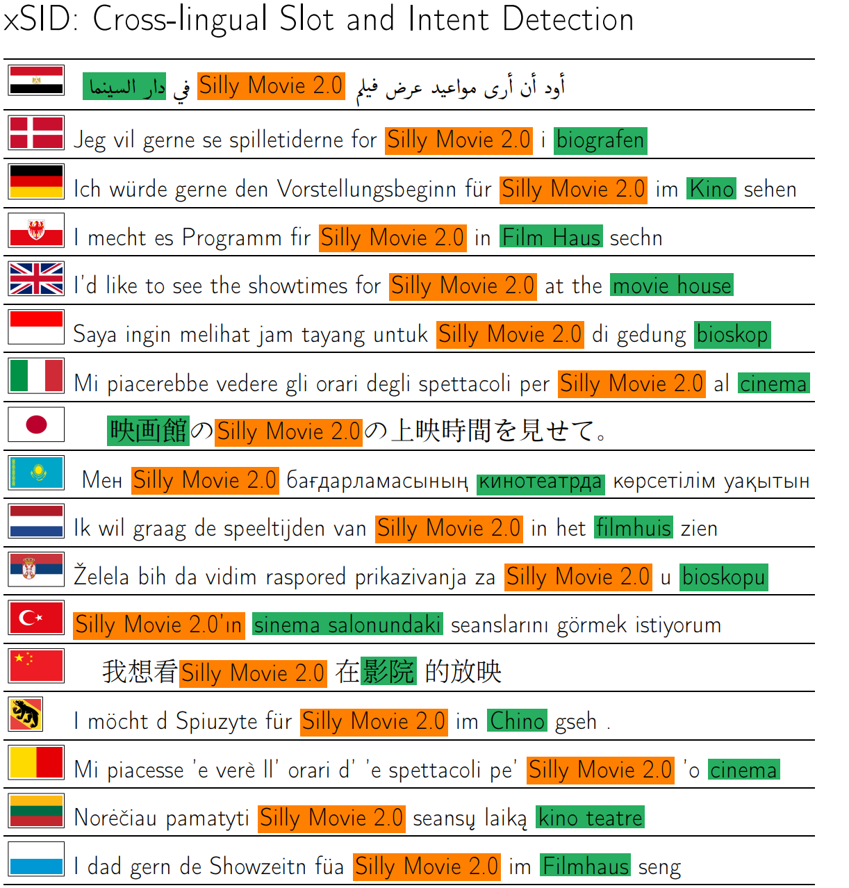

# From Masked-Language Modeling to Translation: Non-English Auxiliary Tasks Improve Zero-shot Spoken Language Understanding

This repository contains all code to reproduce the results in the paper. If you are just here for the data, see the `data/` folder (AND DON'T FORGET TO CITE THE PAPERS LISTED BELOW) 

[]()

**NOTE**: Thanks to Evgeniia Razumovskaia, we have found some errors in the original data. We have kept the original data in the repo for reproducability reasons and the fixed version can be found in data/xSID-0.2. The main differences are in Arabic, where we forgot to map the intent labels.

**NOTE** 02-11-2021: Thanks to Noëmi Aepli, we have fixed the sentences in the English dev/test files to match the other languages. And thanks to Milan Grita we have corrected mismatches in words in the comments and the annotation (mainly in the English files).

**NOTE** 29-03-2022: There was an error in the nluEval.py code for calculating the loose overlap (thanks to Mike Zhang for finding and fixing it). The results in the paper for loose f1 were unfortunately overly optimistic.

**UPDATE** 05-2023: version 0.4 is released, including Neapolitan and Swiss German

**UPDATE** 04-2024: version 0.5 is released, including Bavarian and Lithuanian, please also see [https://github.com/mainlp/NaLiBaSID/tree/main](https://github.com/mainlp/NaLiBaSID/tree/main) for alternatives for these languages (including native queries!).

To reproduce all results in the paper, you have to run `./scripts/runAll.sh`. However, in practice this would take a very long time (especially when rerunning nmt-transfer, `./scripts/1.\*`), which is why we would suggest to inspect `./scripts/runAll.sh`, decide which parts are relevant for you, and manually run the required commands parallel. It should be noted that some of the scripts may fail, because we used the MultiAtis dataset, which is not publicly available. To run the experiments on those, [obtain the data](https://catalog.ldc.upenn.edu/LDC2021T04), convert it with `scripts/tsv2conll.py` in `data/multiAtis`. Alternatively, one could remove the `MultiAtis` key from the `datasets` dictionary in `scripts/myutils.py`. All tables and graphs of the paper can be reproduced by running `scripts/genAll.sh`.

The experiments are divided in the scripts folder:

* 0.\* Data preparation and setup 
* 1.\* Translated the training data for the `nmt-transfer` model 
* 2.\* Trains MaChAmp for all languages and predicts on all files 
* 3.\* Generated the main table in the paper 
* 4.\* Run on the test data 
* 5.\* All additional experiments for the analysis section in the paper 
* 6.\* Generate all tables for the appendix 

For many parts we also included the outputs so that it is not always necessary to re-run. The automatically translated training data as well as the automatically converted English training data can be found in `/data/xSID/`. The output predictions and scores of all models are also included in `predictions/`.

This code is largely based on [MaChAmp](https://machamp-nlp.github.io/), we include a copy of the exact version of MaChAmp that was used.

## Citation
```
@inproceedings{van-der-goot-etal-2021-masked,
    title = "From Masked Language Modeling to Translation: Non-{E}nglish Auxiliary Tasks Improve Zero-shot Spoken Language Understanding",
    author = {van der Goot, Rob  and
      Sharaf, Ibrahim  and
      Imankulova, Aizhan  and
      {\"U}st{\"u}n, Ahmet  and
      Stepanovi{\'c}, Marija  and
      Ramponi, Alan  and
      Khairunnisa, Siti Oryza  and
      Komachi, Mamoru  and
      Plank, Barbara},
    editor = "Toutanova, Kristina  and
      Rumshisky, Anna  and
      Zettlemoyer, Luke  and
      Hakkani-Tur, Dilek  and
      Beltagy, Iz  and
      Bethard, Steven  and
      Cotterell, Ryan  and
      Chakraborty, Tanmoy  and
      Zhou, Yichao",
    booktitle = "Proceedings of the 2021 Conference of the North American Chapter of the Association for Computational Linguistics: Human Language Technologies",
    month = jun,
    year = "2021",
    address = "Online",
    publisher = "Association for Computational Linguistics",
    url = "https://aclanthology.org/2021.naacl-main.197",
    doi = "10.18653/v1/2021.naacl-main.197",
    pages = "2479--2497",
}
```
If you use version >= 0.4 (which includes Neapolitan and Swiss German), please also cite:

```
@inproceedings{aepli-etal-2023-findings,
    title = "Findings of the {V}ar{D}ial Evaluation Campaign 2023",
    author = {Aepli, No{\"e}mi  and
      {\c{C}}{\"o}ltekin, {\c{C}}a{\u{g}}r{\i}  and
      Van Der Goot, Rob  and
      Jauhiainen, Tommi  and
      Kazzaz, Mourhaf  and
      Ljube{\v{s}}i{\'c}, Nikola  and
      North, Kai  and
      Plank, Barbara  and
      Scherrer, Yves  and
      Zampieri, Marcos},
    editor = {Scherrer, Yves  and
      Jauhiainen, Tommi  and
      Ljube{\v{s}}i{\'c}, Nikola  and
      Nakov, Preslav  and
      Tiedemann, J{\"o}rg  and
      Zampieri, Marcos},
    booktitle = "Tenth Workshop on NLP for Similar Languages, Varieties and Dialects (VarDial 2023)",
    month = may,
    year = "2023",
    address = "Dubrovnik, Croatia",
    publisher = "Association for Computational Linguistics",
    url = "https://aclanthology.org/2023.vardial-1.25",
    doi = "10.18653/v1/2023.vardial-1.25",
    pages = "251--261",
}
```

If you use version >= 0.5 (which includes Bavarian and Lithuanian), please also cite:

```
@inproceedings{winkler-etal-2024-slot,
    title = "Slot and Intent Detection Resources for {B}avarian and {L}ithuanian: Assessing Translations vs Natural Queries to Digital Assistants",
    author = "Winkler, Miriam  and
      Juozapaityte, Virginija  and
      van der Goot, Rob  and
      Plank, Barbara",
    editor = "Calzolari, Nicoletta  and
      Kan, Min-Yen  and
      Hoste, Veronique  and
      Lenci, Alessandro  and
      Sakti, Sakriani  and
      Xue, Nianwen",
    booktitle = "Proceedings of the 2024 Joint International Conference on Computational Linguistics, Language Resources and Evaluation (LREC-COLING 2024)",
    month = may,
    year = "2024",
    address = "Torino, Italia",
    publisher = "ELRA and ICCL",
    url = "https://aclanthology.org/2024.lrec-main.1297",
    pages = "14898--14915",
@inproceedings{Winkler2024,
  title = "Slot and Intent Detection Resources for {B}avarian and {L}ithuanian: Assessing Translations vs Natural Queries to Digital Assistants",
  author = "Winkler, Miriam and Juozapaityte, Virginija and van der Goot, Rob and Plank, Barbara",
  booktitle = "Proceedings of The 2024 Joint International Conference on Computational Linguistics, Language Resources and Evaluation",
  year = "2024",
  publisher = "Association for Computational Linguistics",
}
```


